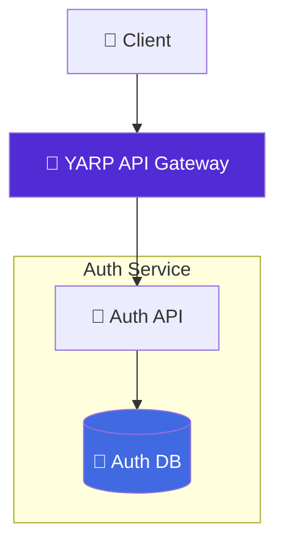

# 🔐 Auth Service

[](https://dotnet.microsoft.com/en-us/download/dotnet/9.0)
[](https://www.docker.com/)
[](https://www.postgresql.org/)
[](https://jwt.io/)
[](https://opensource.org/licenses/MIT)

Authentication microservice for the **Food Delivery Microservices** project. It provides user signup/login, JWT-based authentication, refresh tokens, and a protected profile endpoint, with PostgreSQL persistence and Docker-friendly startup.

---

## ⚡ Features

* User signup / login with **Argon2id** password hashing
* **JWT access tokens** with refresh token support
* Secure logout that revokes refresh tokens
* Protected `/me` endpoint with user claims
* Correlation ID middleware and custom exception handling
* Automatic database migrations on startup
* Healthcheck endpoint for Docker Compose
* Swagger UI with **Bearer token** security scheme
* Forwarded headers support for running behind **YARP**

---

## 🧭 Architecture



The service exposes a compact HTTP API and a `/health` endpoint used by container healthchecks.

---

## 🛠 Prerequisites

* Docker 20.10+
* Docker Compose v2+
* (Optional) .NET 9 SDK for local development
* (Optional) Git

> **Note:** You can run the service fully containerized without installing the .NET SDK locally.

---

## 🚀 Quick Start

You can run the service **standalone** or as part of the **full microservices stack**.

### Full Stack

```bash
# 1. Clone the repository with all microservices (submodules)
git clone --recursive https://github.com/dxrkblxss/food-delivery-microservices.git

# 2. Go to project directory
cd food-delivery-microservices

# 3. Configure environment variables (required before start):
cp .env.example .env
# No changes needed for a quick test, 
# but recommended to edit for production.

# 4. Spin up the entire infrastructure
docker-compose up -d --build
```

> [!IMPORTANT]
> The Auth Service will be available through the API Gateway at
> `http://localhost:8080/auth`

### Auth Service Only

```bash
# 1. Clone the repository
git clone https://github.com/dxrkblxss/auth-service.git

# 2. Go to project directory
cd auth-service

# 3. Build the Docker image
docker build -t auth-service:latest .

# 4. Run the container
docker run --rm -p 8081:8080 auth-service:latest
```

> [!IMPORTANT]
> After startup, the service is available on your host at
> `http://localhost:8081`

---

## ⚙️ Configuration

The service uses standard ASP.NET Core configuration layering:

* `appsettings.json` — shared defaults
* `appsettings.Development.json` — local development overrides

Main configuration values:

* `ConnectionStrings:DefaultConnection` — PostgreSQL connection string
* `Jwt:Key` — secret used to sign and validate access tokens
* `Jwt:Issuer` / Jwt:Audience — token validation metadata
* `Jwt:AccessTokenMinutes` — access token lifetime
* `RefreshTokenSettings:DaysValid` — refresh token lifetime
* `RefreshTokenSettings:TokenLengthBytes` — refresh token entropy
* `Hashing:*` — Argon2id password hashing parameters

> [!TIP]
> You can generate a secure 32-character key using:
> `openssl rand -base64 32`

---

## 🛠️ Run (development / local testing)

You can run the service **as part of the full stack** or **individually**.

### Full Stack

If you have all services installed via the main repository:

```bash
cd food-delivery-microservices

docker compose up --build
```

Or in detached mode:

```bash
docker compose up -d --build
```

> [!IMPORTANT]
> The Auth Service will be available via the API Gateway at
> `http://localhost:8080/auth`

### Auth Service Only

If you want to run only this service locally:

**Using .NET SDK**

```bash
# from the repository root
dotnet restore
dotnet run
```

**Using Docker**

```bash
docker build -t auth-service:dev .
docker run --rm -p 8081:8080 auth-service:dev
```

If you are connecting to a PostgreSQL container, make sure both containers are on the same Docker network.

---

## 🔎 API Discovery & Documentation

Swagger UI is available for testing and exploring endpoints.

* **Swagger UI:** `http://localhost:8081/swagger`
* **Service base URL:** `http://localhost:8081`

Swagger includes Bearer authentication support, so you can authorize requests directly from the UI.

> [!TIP]
> Swagger is enabled by default in `Development` environment. If you change `ASPNETCORE_ENVIRONMENT` to `Production`, Swagger UI might be disabled depending on your service configuration.

---

## 🧪 Development (per-service)

If you want to develop the Auth Service locally (recommended):

1. Open the service folder.
2. If you have the .NET SDK installed you can run the service directly:

```bash
cd auth-service
# restore & run
dotnet restore
dotnet run --launch-profile Development
```

3. Or build and run the service container with Docker:

```bash
docker build -t auth-service:dev .
# run with appropriate env vars pointing to your PostgreSQL instance
```

> [!TIP]
> When running the container manually, make sure it can access the database container by joining the same Docker network.
> For example:
> ```bash
> docker run --network food-delivery-microservices_default ...
> ```

# If you have the .NET SDK installed, run the service directly:

# restore & run
dotnet restore
dotnet run --launch-profile Development

Or build and run the service container with Docker:

docker build -t auth-service:dev .
# run with appropriate env vars pointing to your PostgreSQL instance

---

## 🧩 Tips & Troubleshooting

* If the service starts but healthcheck fails, verify the database is reachable and the connection string is correct.
* Inspect logs with:

```bash
docker logs -f auth-service
```

* If you change environment variables, rebuild and recreate the container:

```bash
docker build -t auth-service:latest .
docker run --rm -p 8081:8080 auth-service:latest
```

* If Swagger is not visible, check whether the app is running in `Development` mode.

---

## 🛠️ What you can extend

* Add role-based authorization and admin-only endpoints
* Add email verification / password reset flows
* Add OAuth2 / OpenID Connect login providers
* Add refresh-token rotation and session management UI
* Add integration tests for auth flows and token validation

---

## 📄 License

This project is released under the MIT License. See `LICENSE` for details
