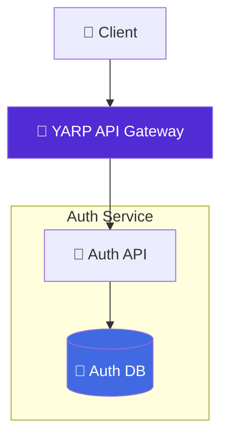

# auth-service

[](https://dotnet.microsoft.com/en-us/download/dotnet/9.0)
[](https://www.docker.com/)
[](https://www.postgresql.org/)
[](https://jwt.io/)
[](https://opensource.org/licenses/MIT)

**Authentication microservice** for the [Food Delivery Microservices](https://github.com/dxrkblxss/food-delivery-microservices) project.

---

## ⚡ Features

* User signup / login with Argon2id password hashing
* JWT access tokens (15 min) + long-lived refresh tokens (7 days)
* Secure logout (revokes refresh token)
* Protected `/me` endpoint with claims
* Correlation ID middleware + custom exception handling
* Automatic DB migrations on startup
* Health check endpoint for Docker Compose
* Swagger UI with Bearer token security scheme
* Forwarded headers support (works perfectly behind YARP)

---

## 🧭 Architecture



Minimal API endpoints are defined in `Program.cs` + clean folder structure:

```text
textDTOs/      • Models/      • Services/
Repositories/  • Middleware/  • Exceptions/
Options/       • Filters/     • Migrations/
```
