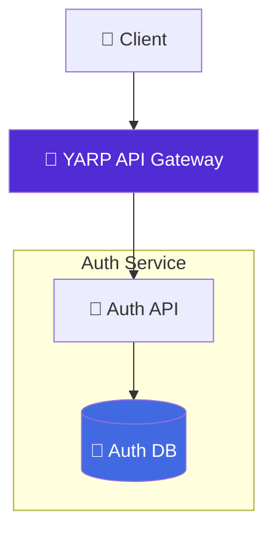

# 🔐 Auth Service

[](https://dotnet.microsoft.com/en-us/download/dotnet/9.0)
[](https://www.docker.com/)
[](https://www.postgresql.org/)
[](https://jwt.io/)
[](https://opensource.org/licenses/MIT)

Authentication microservice for the **Food Delivery Microservices** project. It exposes a small HTTP API for signup, login, token refresh, logout, and current-user retrieval. The service uses **PostgreSQL** for persistence and is designed to run either behind the API Gateway or on its own during local development.

---

## ⚡ Features

* Authentication endpoints for **signup**, **login**, **refresh**, **logout**, and **current user**
* **JWT access tokens** plus refresh token rotation
* **PostgreSQL** persistence for users and refresh tokens
* Automatic database migrations on startup
* Healthcheck endpoint for Docker Compose
* Swagger UI with **Bearer token** support
* Forwarded headers support for running behind **YARP**
* Environment-driven configuration for local and containerized runs

---

## 🧭 Architecture



The service exposes a small HTTP API and a `/health` endpoint used by Docker Compose healthchecks.

---

## 🛠 Prerequisites

* Docker 20.10+
* Docker Compose v2+
* (Optional) .NET 9 SDK for local development
* (Optional) Git

> **Note:** You do not need the .NET SDK to run this service in a container. You only need Docker and a reachable PostgreSQL instance.

---

## 🚀 Quick Start

If you are using this service as part of the full microservices stack:

```bash
# 1. Clone the repository with all microservices (submodules)
git clone --recursive https://github.com/dxrkblxss/food-delivery-microservices.git

# 2. Go to project directory
cd food-delivery-microservices

# 3. Configure environment variables (required before start):
cp .env.example .env
# No changes needed for a quick test,
# but recommended to edit for production.

# 4. Spin up the entire infrastructure
docker compose up -d --build
```

> [!IMPORTANT]
> Once the containers are running, the Auth Service is accessible through the API Gateway at
> `http://localhost:8080/auth`

---

## ⚙️ Configuration

The service uses standard ASP.NET Core configuration files plus environment variables.

Main configuration values:

* `ConnectionStrings:DefaultConnection` - PostgreSQL connection string
* `Jwt:Key` - secret used to sign and validate access tokens
* `Jwt:Issuer` - token issuer
* `Jwt:Audience` - token audience
* `Jwt:AccessTokenMinutes` - access token lifetime
* `RefreshTokenSettings:DaysValid` - refresh token lifetime
* `RefreshTokenSettings:TokenLengthBytes` - refresh token entropy
* `Hashing:MemorySize`, `Hashing:Iterations`, `Hashing:DegreeOfParallelism` - password hashing settings

When the service is started through the root `docker-compose.yml`, the main values come from the root `.env` file:

* `ASPNETCORE_ENVIRONMENT`
* `AUTH_DB_NAME`, `AUTH_DB_USER`, `AUTH_DB_PASSWORD`
* `JWT_KEY`

> [!TIP]
> You can generate a secure key using:
> `openssl rand -base64 32`

---

## 🛠️ Run (development / local testing)

Run the full stack from the repository root:

```bash
docker compose up --build
```

Or in detached mode:

```bash
docker compose up -d --build
```

This starts the Auth Service together with its PostgreSQL database and exposes it through the API Gateway at `http://localhost:8080/auth`.

If you want to run the service by itself from the `auth-service/` folder:

```bash
dotnet restore
dotnet run --launch-profile Development
```

By default, the `Development` launch profile serves the app on `http://localhost:5163` and uses the connection string from `appsettings.Development.json`.

You can also build the container manually:

```bash
docker build -t auth-service:dev .
```

When running the container manually, provide a reachable PostgreSQL connection string and `Jwt__Key`.

---

## 🔎 API Discovery & Documentation

When the full stack is running, you can access the service through the gateway:

* **Gateway Base URL:** `http://localhost:8080`
* **Auth Service via Gateway:** `http://localhost:8080/auth`
* **Auth Swagger via Gateway:** `http://localhost:8080/auth/swagger`

When the service is run directly in development:

* **Swagger UI:** `http://localhost:5163/swagger`
* **Service base URL:** `http://localhost:5163`

Swagger includes Bearer authentication support, so you can authorize requests directly from the UI.

---

## 🧪 Development (per-service)

If you want to develop this service locally:

1. Open the `auth-service/` folder.
2. Run the app with the .NET SDK:

```bash
dotnet restore
dotnet run --launch-profile Development
```

3. Or build the service container with Docker:

```bash
docker build -t auth-service:dev .
```

> [!TIP]
> If you run the service container manually, make sure it can reach the PostgreSQL instance you configure in `ConnectionStrings__DefaultConnection`.

---

## 🧩 Tips & Troubleshooting

* If the service starts but healthchecks fail, verify that PostgreSQL is reachable and that `ConnectionStrings:DefaultConnection` is correct.
* Inspect logs with:

```bash
docker compose logs -f auth-service
# or, if you started the container manually
docker logs -f auth-service
```

* If you change environment variables in the full stack, recreate the containers:

```bash
docker compose down -v
docker compose up -d --build
```

* Database data is persisted when you run the full stack through the named volume defined in the root `docker-compose.yml`.

---

## 🛠️ What you can extend

* Add role-based authorization / RBAC
* Add email verification and password reset flows
* Add integration tests around login and refresh token rotation

---

## 📄 License

This project is released under the MIT License. See `LICENSE` for details.
